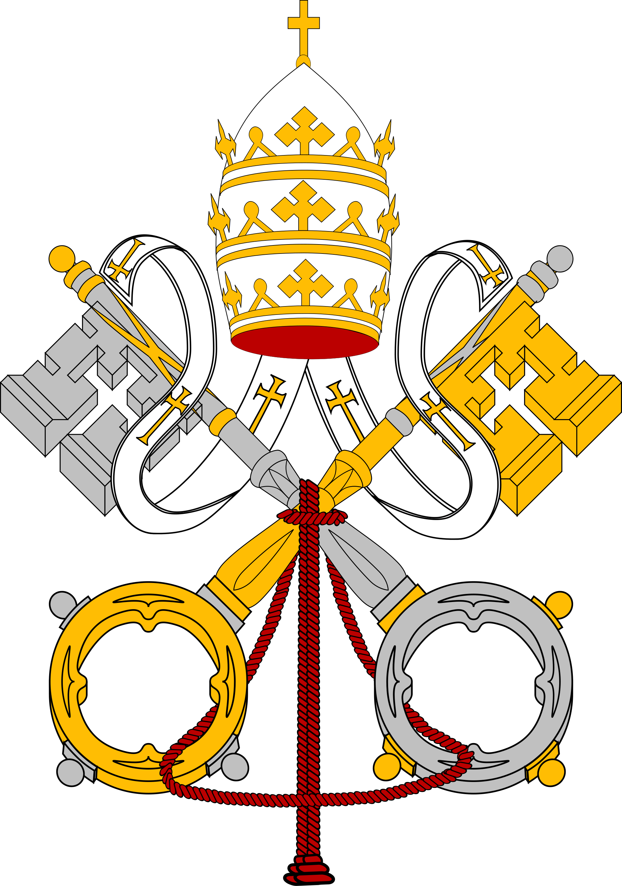
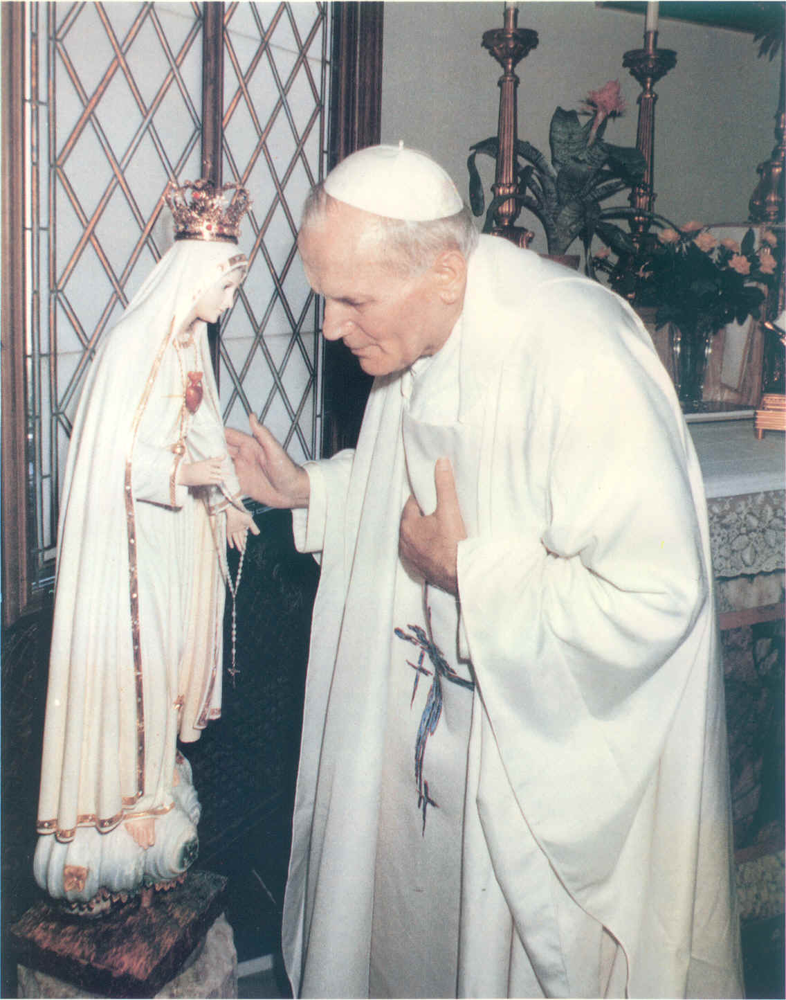
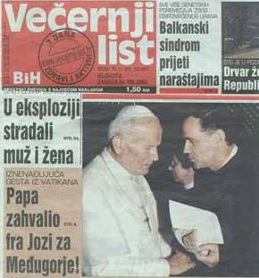
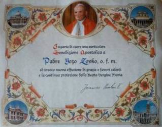
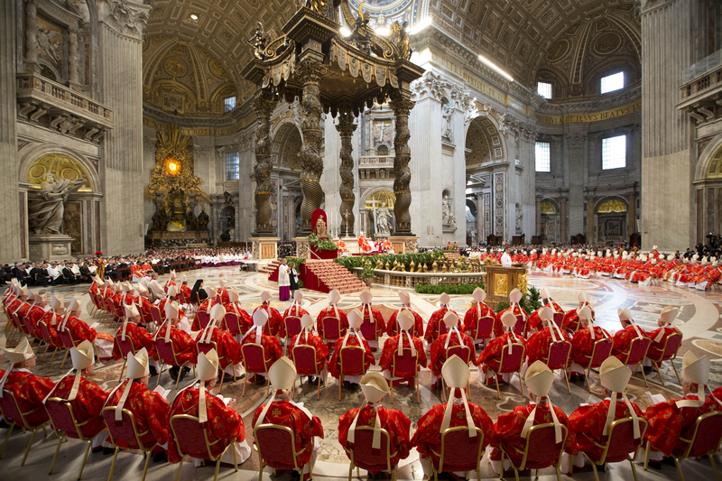

#### 목차

1. [메주고리예 성모 발현에 대한 바티칸의 의견](#vatican)
2. ["메주고리예는 파티마의 연장이고 실천입니다" - 교황 성 요한 바오로 2세](#john)
3. [요조 신부가 교황 성 요한 바오로 2세에게 특별 강복장을 받다](#yojo)
4. [메주고리예 성모 발현에 대한 교황청 심사위원회의 최종 보고서](#report)

---

### 메주고리예 성모 발현에 대한 바티칸의 의견

<blockquote class="blockquote" style="margin-left: 1rem; margin-right: 1rem;">

<em>메주고리예는 누구나 원한다면 갈 수 있는 곳임을 확인합니다.
바티칸 교황청은 가톨릭 신자들이 메주고리예를 가면 안 된다고 말한 적이 단 한번도 없습니다.</em>

<footer class="blockquote-footer">(1996년 8월 2일 가톨릭 뉴스 서비스와 바티칸 대변인과의 인터뷰)</footer>
</blockquote>

1996년 6월 초부터, 많은 언론 기관은 바티칸이 메주고리예로의 순례를 금지했다고 보도했다. 바티칸 대변인 요아킴 나바로 발스는 즉각 이를 부인하는 공식 기사를 발표하였다. 메주고리예에 관한 바티칸의 입장이 잘못 알려지는 것을 우려하여 교황청 대변인은 바티칸에서는 가톨릭 신자들이 메주고리예 순례를 가서는 안 된다고 말한 적이 단 한번도 없다는 입장을 다시 한번 명확히 했다.

*"가톨릭 신자들이 어디를 가더라도 그들은 영신적인 보호와 지도를 받을 권리가 있기 때문에, 평신도가 조직한 메주고리예 순례단에 성직자가 함께 하는 것을 교회가 막아서는 안 된다는 것을 확인합니다."*

8월 21일 가톨릭 뉴스 서비스와의 인터뷰에서 대변인 요아킴 나바로 발스는 “교회나 바티칸이 메주고리예에 대해 ‘아니오’라고 말했습니까? ‘아닙니다." 라고 공식 입장을 확인해주었다. 바티칸 대변인은 다음과 같이 말했다.

*"발현이 거짓으로 판명나기 전까지 바티칸은 메주고리예로 갈 수 없다고 말할 수 없습니다. 아직 조사중이기 때문에, 곧 누구나 원한다면 갈 수 있는 곳임을 확인합니다. 또한 가톨릭 신자들은 어디를 가더라도 영적인 보호와 지도를 받을 권리가 있습니다. 로마 바티칸의 공식입장은 평신도가 조직한 메주고리예 순례단에 성직자가 함께 하는 것을 교회가 막아서는 안된다고 하는 것입니다. 마치 남아프리카를 방문하는 가톨릭 신자들과 성직자가 함께 하는 것을 금하지 않는 것과 같습니다."*

---

### "메주고리예는 파티마의 연장이고 실천입니다."

<figure class="figure">

<figcaption class="figure-caption">파티마 성모님께 인사를 드리는 성 교황 요한 바오로 2세.</figcaption>
</figure>

* 1986년 6월 : 메주고리예  순례자들에 대한 사목적 조언을 얻고자 하는 12명의 이탈리아 주교들의 질문에 대하여 교황은 "사람들이 회개, 기도, 고해, 속죄, 단식한다면 메주고리예로 가게 하십시오.“라고 말했다.

* 1990년 4월: "메주고리예는 거대한 영신적 중심지입니다.” 브라질 플로리아노 폴리스의 부주교인 무릴로 크리거 주교가 4번째 메주고리예 순례를 떠나기 전에 밝힌 교황의 언급이다. 교황께선 주교의 요청에 동의하시고 목격증인들에게 교황의 축복을 주셨다.

*  1992년 : 보스니아 전쟁이 한창일 때 교황께서는 요조 신부에게 "저는 당신과 함께 있습니다. 메주고리예를 보호하십시오! 우리 성모님의 말씀을 보호하십시오!"라고 말했다.

* 1995년 4월  : 크로아티아 사절단이 교황을 공식 방문했다. 교황은 공식성명을 읽은 후 이렇게 말했다. "저는 스플릿, 리아비스트리카, 메주고리예를 가보고 싶습니다!" 폴란드가 공산주의로부터 자유를 찾은 것을 언급할 때 "파티마와 메주고리예에서 발현하고 계시는 성모님의 은총입니다.", **"메주고리예는 파티마의 연장이고, 실천입니다."** 라고 말했다.

---

### 요조 신부가 교황 성 요한 바오로 2세에게 특별 강복장을 받다

<figure class="figure">

</figure>

1992년, 요조 신부는 교황 성 요한 바오로 2세를 만났다. 10년 후, 요조 신부는 교황 강복장을 받았다. 강복장에는 이런 내용이 있었다. **“나는 요조 조브코  신부에게 마음을 다해 특별 강복을 내리며, 은총이 가득하신 동정 마리아께서 그에게 큰 은총과 천상의 축복을 가득히 내려주시어 계속해서 지켜주시기를 기원합니다.”**

---

### 메주고리예 성모 발현에 대한 교황청 심사위원회의 최종 보고서

<blockquote style="margin-left: 1rem; margin-right: 1rem;">

<이 기사는  Spirit Daily의 Michael H. Brown 의 기사 내용을 번역 및 참조하였습니다>

<footer class="blockquote-footer">(2017년 6월 평화의 모후 선교회 발행  "평화의 모후" 제 75호 소식지에서)</footer>
</blockquote>

#### 신비의 한 부분이 풀리다

전임 교황 베네딕토 16세께서 재임 시에 지명하신  **“메주고리예 성모 마리아 발현 심사위원회”의 최종 보고서 내용이 교황청 언론지인 “바티칸 인사이더” 의 2017년 5월 16일자에 중요한 뉴스로 보도가 되었습니다.** 루이니 추기경이 이끄는 매주고리예 심사위원회는 일단의 신학자, 심리학자, 마리아론학자 그리고 주교 및 추기경들의 17인으로 구성되었으며, 이 위원회는 2010년 부터 2014년까지 4년간에 걸쳐서 메주고리예 성모 마리아 발현에 대한 진위여부를 심사하였습니다.

2014년에 루이니 추기경께서는 메주고리예 관한 조사의 결과 내용을 현 프란시스코 교황께 보고하였습니다. 그 내용은 **4년 동안의 심사 및 연구 끝에 메주고리예에서의 초기 7일간의 성모 발현이 "신뢰할 만함"으로 판단되었다**고 보고된 내용의 기사이었기에 많은 주목을 받게 되었습니다. 곧이어 이 내용은 영국의 “가톨릭 헤럴드지” 에 의해 확인이 되었습니다.

“신뢰할 만함”이란 말은 "믿을 수 있는", "근거가 있는", "설득력 있는"의 뜻으로도 정의가 됩니다.

교황성하께서 이 조사 결과를 어떻게 판정하실지는 아직 확실치 않지만 이변이 없으면 이 초기 발현에 대한 추가적인 조사가 이루어질 것입니다. 심사위원회가 모든 면에서 높이 평가하고 추천하였듯이 메주고리예 성모 마리아 발현지는 각 교구들로부터 공식적으로 순례가 허용되는 성지(Shrine)로 선포될 가능성이 매우  높은 것으로 보입니다.

또한 금년 2월에 교황청에서 메주고리예에 파견된 교황 특사 핸드릭 호세르 주교는 이보다 더 강력한 평가를 내리기도 하였습니다. **최종 판결에 참석한 15명의 심사위원회들은 메주고리예의 초기 발현 현상에 관하여 찬성 13명,  반대 1명, 1명은 판정을 유보함으로서, 13대 1의 표결 결과로 “메주고리예에서의 성모 마리아의 최초 발현은 신뢰할 만함”으로  판정하였다고 합니다.** 이 내용들을 객관적인 관점에서 고찰하여 보도록 하겠습니다.

메주고리예 성모 발현에 대한 조사를 수행한 심사 위원단의 권위있는 전문가들과 관련돤 성직자들은 메주고리예 현지에서 상당한 기간을 머물며 성모 발현의 관련 목격자들을 심도있게 관찰하고  조사하였습니다. “바티칸 인사이더”의 보도에 따르면 "심사위원회”는  메주고리예 성모 발현 현상을 "초기의 7일 간 발현"과 그 이후 전개된 상황들 사이에 아주 명백한 차이가 있음에 주목하였습니다.

이를 두 단계로, 즉 1981년 6월 24일 부터 7월 3일 사이에 일어난 "최초 7번의 발현"과, 이후 일어난 모든 발현들로 나누어서 판정하기로 결정하였으며, 초기 7일 간의 발현에 있어서는 초자연적인 현상이 있었던 것으로 결론을 내렸습니다.  심사위원회는 초기 7번의 발현 이후에 일어난 추후의 발현들에 대하여 부정하는 판정을 내리지는 않았지만, 이에 대하여 의견이 엇갈린 위원회는 좀 더 시간을 두고 지켜보자는 태도를 취하였으며 또한 그중 일부 발현들이 취급되어 온 방법에 대하여 우려를 표명하였습니다.

#### 여기에는 두 가지의 주요 "시사점"이 있습니다.

**첫째**, 초기 일곱 번의 발현은 파티마나 과달루페와 같은 공식적으로 인정된 유명한 역사적 발현보다 더 많다는 것과 유사하다는 것을 알 수 있습니다.

**둘째**, 첫 일곱 번의 발현에 대해서는 위원회가 확신을 갖는 반면, 1981년 7월 초 이후의 발현들에 대해서 확신을 갖지 못하는 이유는 무엇인지에 대해 궁금증을 갖게 합니다. 이점은 우리를 당혹스럽게도 하고 또한 흥미를 갖게도 합니다.

#### 왜 7월 3일이 기준이 되는지요?

그 첫 주간동안 6명의 목격증인들은 성모님을 동시에, 또는 거의 동시에 목격했음에 주목할 수 있습니다.  같은 대상을 동시에 본 사람들이 다수이기 때문에 그 발현들의 진정성이 확고해지며, 이 일치성은 교회의 입장에서 보면 매우 중요한 판단 요소임은 분명합니다. 따라서 심사위원들의 이러한 신중함은 다음과 같은 파티마 성모님의 발현에 대한 일들을 상기시켜 줍니다.

그것은 파티마 성모님 발현 중 1917년 5월에서 10월까지 6 번의 발현중에 3 명의 목격증인들 모두에게 동시에 목격된 것을 인준하고, 3명의 목격증인중에 어린 나이에 죽은 프란치스코 (9살, 1908-1919) 희야친따 (7살, 1910-1920)외에 97세에 죽은 루시아 도스 산토스 수녀(1907-2005)의 개별적인 신비스런 경험들은 공식적으로 인정되지 않고 있는 것과 같은 이유입니다. (이전부터 있었던 시도이지만 비판론자들은 심사위원회가 7월 3일 이후의 발현들에 대하여 판단을 유보하고 신중하려는 것을 부정적으로 이용하려 하고 있습니다.)

#### 메주고리예 발현 첫번째 주간 이후에 어떤 일이 일어났는가?

 공산당 관리들과 현지 경찰들은 메주고리예의 발현상황에 개입하여 "발현산"에서 군중들을 해산시키고, 여러번에 걸쳐 목격증인들을 다른 곳으로 끌고가서 분산시켰기 때문에 목격 증인들은 그들이 있는 현장에서 각각의 발현이 일어 났습니다. 한번은 경찰이 공무를 수행하는 자동차 안에서도 아이들에게 성모님의 발현이 일어난 적도 있었습니다. 무신론적 정부는 이 성모 마리아의 발현이 대중에게 끼칠 영향에 대하여  조바심을 내기 시작하였습니다. 이에 따라서 첫 발현이 일어난지 4일째부터 공산 경찰 당국의 개입이 시작되었습니다.  이전의 성모님의 발현들은 그 발현이 일어난 나라 뿐만 아니라  세계의 다른 여러 지역에서 가톨릭 신심이 되살아 나는 계기가 되었기 때문입니다.

7월 1일, 마을 사람들은 공산당원 및 경찰들과 함께 메주고리예에 있는 학교에서 회의를 갖도록 소환되었습니다. 영국의 한 저널리스트  메리 크레이그는 그의 저서에서 *"'목격증인들은 발현산 및 교회에 갈 수 없도록 금지 당했다'라고 적고 있었습니다. 만일 목격증인들이 발현산에 다시 가게 된다면, 그 아이들이 정신적으로 비정상인 것으로 판정하고, 이후로는 모든 교육을 받지 못하도록 할 것이라고  공산당원들은 그들의 부모들을 협박하였습니다. 또한 아이들의 부모들은 공산당 체제가 자주 사용하는 특유의 인신공격에 시달리기도 하였습니다."* 라고 전했습니다.

하버드대 출신 변호사이며, 프란시스칸 대학교 총장인 마이클 스캔런 신부가 출간한 책에서, 메주고리예를 잘 아는 스베토잘 크랄리에비치 신부는 *"7월 3일 이후에는, 각 발현에서 일어난 아이들과 성모님 사이의 특정한 대화 내용을 알 수가 없다."* 고 진술하고 있습니다. 또한 스베토잘 신부는 *"많은 군중들 때문에, 발현은 언덕 위에서 이루어졌는데 이곳에서 성모님께서는  1981년 8월 12일까지 매일 발현하셨다. 이후 정부 당국은 모든 사람들에게 발현산에 올라가지 못하도록 금지하였다. 따라서, 6명의 목격증인 아이들은 성모님의 발현지를 자신들의 마을 비야코비치와 숲속 및 들판으로 옮겼으며, 주민들은 성모님을 기다리기 위하여 그곳에 모두 함께 모여 기도하였다. 이러한 일들을 중지시키기 위하여 정부 관리들이 소집되었다. 6일째 되는 날, 이 어린이들은 당국에 의해 치트룩시로 소환되었고, 다시 모스타르시(지방 행정관청이 있는 곳)의 “닥터 사페트 무지치 병원” 의 신경정신과로 보내졌다. 의사들은 이 6명의 어린 목격증인들이 정신질환자이거나 환각을 경험하고 있는 것으로 여겼다. 그러나 어린 목격증인들은 철저한 의학조사를 위해 모든 검사를 성실하게, 거리낌이 받았고, 모든 질문에 대한 답변을 잘하였으며, 담당 의사인 물리야 드쥬드다 박사는 목격증인들이 건전하며 건강하다는 진료의 판정을 내렸다."* 라고 덧붙였습니다. **다시 말해 초기 7일 간의 발현만이 "신뢰할 만함"에 해당된 이유는, 그 이후부터 정부 당국의 개입으로 인해 각 목격증인들의 발현 내용들을 추적하는 것이 어렵게 되었기 때문입니다.** 이것은 파티마에서 첫번째 주간 동안 현지 당국이 발현 사태에 개입했던 것을 상기시켜 줍니다.

성모님은 발현 첫해 동안 말씀하시기를, **“사탄이 성모님의 계획에 대한 방해를 시도할 것”** 이라며 계속해서 어린 목격증인들에게 경고하시며 기도와 희생을 당부하셨는데, 이는 성모님께서 전인류의 회심을 위하여, 교회를 구하시고, 징벌을 면하게 하시려고 이 세상의 온 인류에게 경고하시는 것입니다.

**"사랑하는 나의 자녀들아! 오늘도 나는 기도하며 하느님께 모든 것을 맡기라고 너희를 부르고 있다. 너희는 내가 너희를 사랑한다는 것을 알고 있다. 또한 너희를 사랑하는 마음에서, 너희에게 평화의 길과 너희 영혼을 구원하는 길로  인도하려고 내가 이곳에 오고 있다는 것도 알고 있다. 그러니 나에게 귀를 기울이며, 사탄이 너희를 유혹하지 못하게 하라고 부탁한다. 사랑하는 아이들아, 사탄은 매우 강하다. 그러기에 사탄의 영향을 받고 있는 사람들이 구원될 수 있도록, 너희 기도를 나에게 봉헌해주기를 부탁한다. 너희 삶으로 증거하여다오. 그리고 너희 삶을 세상의 구원을 위해 희생하여라. 나는 너희와 함께 있고 너희에게 고마워하고 있단다. 너희는 천국에서, 아버지께서 약속하신 상을 받을 것이다. 사랑하는 아이들아, 그러므로 두려워하지 말아라. 너희가 기도하면, 사탄은 너희를 조금도 해칠 수 없단다. 너희는 하느님의 자녀이며, 그분께서 너희를 지켜 주시기 때문이다. 기도하여라. 너희가 나에게 속해 있다는 것을 사탄에게 보여 주는 표시로, 언제나 묵주를 손에 들고 기도하여라. 나의 부름에 응답해 주어서 고맙다.”
(1988년 2월 25일 메주고리예 성모님)**
