### 메주고리예 위치와 기후

메주고리예는 옛 유고 연방에서 독립한 여섯 나라 가운데 하나인 보스니아 헤르체고비나 남부에 위치해 있는 작은 마을이고, ‘산과 산 사이의 지역’이라는 뜻을 지니고 있다. 북쪽에는 산악 지역이 발달해 있고 남쪽에는 해안 지역이 발달해 있는 헤르체고비나는 북부의 산악 지역이 지중해로부터의 공기의 흐름을 차단해 헤르체고비나 지역에 농사에 좋은 기후 조건을 만들어 주기도 한다. 이 지방은 몬테네그로, 보스니아, 남부 크로아티아 그리고 아드리아해에 접해 있다.

이 지역의 기후는 지중해성 기후로 겨울에는 비가 많고 따뜻하며 여름에는 온화하다. 비는 봄에도 오지만 가을에 많은 비가 내리며 11월과 12월에 가장 많은 비가 온다. 아드리아해에서 불어오는 바람이 주를 이루며 이 바람이 습도를 놓여 주고 특히 가을에 많은 양의 비를 몰고 온다. 비가 온 후에 며칠 동안 강한 바람이 불어온다.

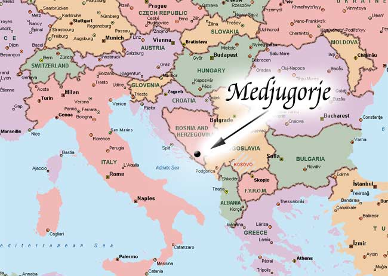

---

### 메주고리예 본당

메주고리예 본당은 헤르체고비나 지역 모스타르 남서쪽 25km 지점에 위치해 있고, 대부분 가톨릭 신자인 약 4,000명의 주민들이 메주고리예에 살고 있다. 헤르체고비나 프란치스코 수도회 성모승천 관구 소속 사제들이 본당 사목을 담당하고 있다. 13세기 이전에 그리스도교를 받아들인 크로아티아인들이 이 지역에 거주하고 있다. 1599년 처음으로 메주고리예 마을이 역사 기록에 언급되었다. 현재 본당은 1892년에 설립되었고 순례자들의 수호성인인 성 야고보 사도에게 봉헌되었다.

---

### 성 야고보 성당

옛 본당 건물은 1892년 본당이 설립되고 얼마 지나지 않은 1897년에 완공되었다. 그 당시 본당 건물은 공간이 넉넉했고 아름다웠다. 그러나 지반이 불안정해 곧 벽에 금이 가기 시작했다. 1차 세계 대전이 끝나자마자 본당 신자들은 새로운 본당 건물을 구상하기 시작했고, 1934년부터 공사를 시작하여 1969년 1월 19일 마침내 새로운 성전 봉헌식을 하게 되었다. 성 야고보 성당은 오늘날 본당 신자들뿐만 아니라 순례자들을 위한 성사와 기도의 중심지 역할을 하고 있다.

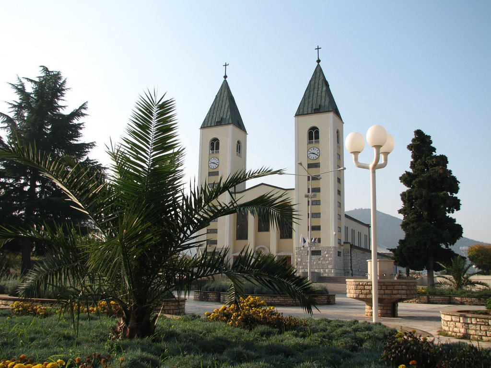

---

### 야외 제단

엄청나게 많은 순례자들이 찾아오는 관계로 1981년부터 본당과 그 주변을 재정비하기 시작했다. 1989년에 세워진 야외 제단과 인근 기도 장소(약 5천 좌석)는 수천 명 이상의 사람들이 메주고리예를 찾는 하절기와 큰 축일과 축제를 위한 모임 장소다.

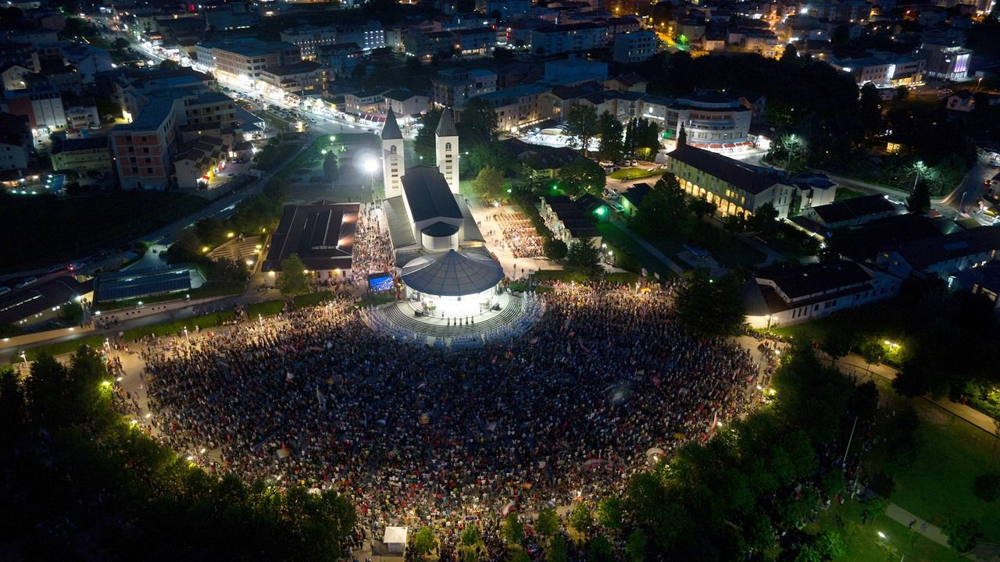

---

### 성모님 발현

발현이 시작된 1981년 본당의 삶은 완전히 바뀌게 된다. 성모님께서 여섯 명의 목격 증인 뿐만 아니라 본당 전체와 순례자들을 당신의 증인과 동역자로 선택하셨기 때문이다. 이는 다음 메시지에서 분명하게 드러났다: **“내가 특별히 이 본당을 선택했고, 직접 이끌고자 한다.” (1984년 3월 1일)** 1981년 6월 24일 오후 6시경 여섯 명의 어린 아이들 **(이반카 이반코비치, 미리야나 드라기체비치, 비스카 이반코비치, 이반 드라기체비치, 이반 이반코비치 그리고 밀카 파블로비치)** 이 크르니카 언덕 혹은 뽓브르도라고 불리우던 곳에서 팔에 아기를 안고, 그들에게 가까이 다가오라고 손짓하는 한 여인을 보게 된다. 그들은 너무도 놀랍고, 그 모습이 성스러워 그 여인 가까이 가지 못했다.

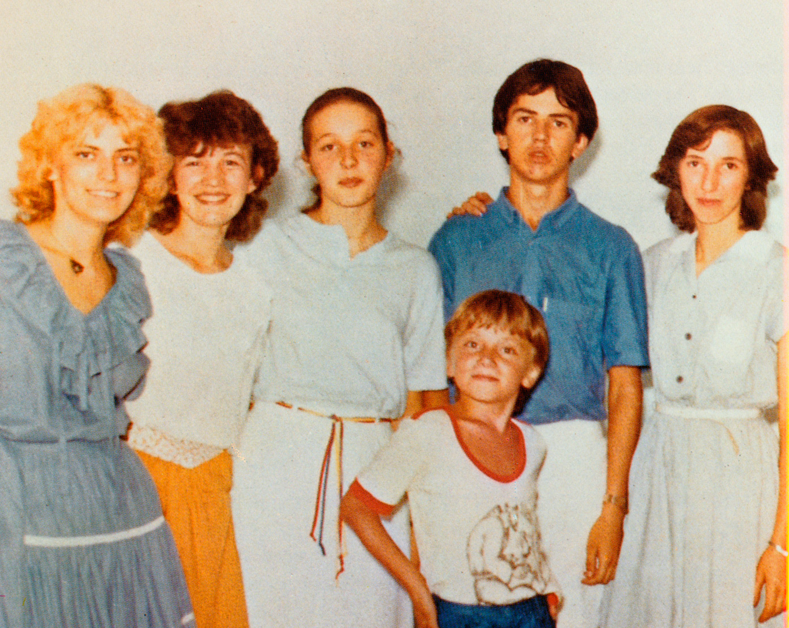
<figcaption class="figure-caption mb-3">1981년 당시 목격 증인들의 사진.
   
  왼쪽부터 미리야나 드라기체비치, 비스카 이반코비치, 이반카 이반코비치, 이반 드라기체비치, 마리야 아브로비치, 그리고 맨 앞의 조그만 소년이 야콥 촐로.
</figcaption>

다음날인 1981년 6월 25일, 전날과 같은 시작 네 명의 아이들-이반카, 미리야나, 비스카 그리고 이반은 그 전날 성모님으로 알아본 그 여인을 만났던 그 장소로 이끌리는 강한 충동을 느꼈다. 마리야 아브로비치와 야콥 촐로가 그들의 대열에 합류했다. 메주고리예 목격증인 그룹이 형성되었다. 그들은 성모님과 함께 기도하고 그분과 대화를 나누었다. 그래서 이날을 성모님의 발현 기념일로 지내는 것이다. 목격증인들은 그날부터 매일 함께 혹은 홀로 그들이 어느 곳에 있든 그곳에서 성모님의 발현을 접하게 되었다고 증언하고 있다. (밀카 파블로비치와 이반 이반코비치는 다시 성모님을 보지 못하게 되었다.)

발현 셋째날인 1981년 6월 26일 성모님께서는 최초로 말씀을 통해 평화에 대한 부르심을 주셨다: **“평화, 평화, 평화, 오직 평화만이 있기를! 하느님과 사람 그리고 사람들 사이에 평화가 넘치기를!”** 성모님의 발현과 메시지에 매료된 사람들, 우선은 본당 신자들 그 뒤에는 다른 마을 사람들과 전 세계에서 몰려든 사람들이 기도하기 시작했다. 발현이 시작된 직후 즉시 목격증인들, 그 부모와 친척들 그리고 본당 신자들과 사제들에 대한 박해가 잇따랐다. 목격증인들은 경찰 조사와 의학적인 검사에 불려 다녔지만 그 결과는 항상 그들이 건강하다는 것이었다. 그 이후 수년 동안 행한 검사에서도 늘 같은 결론이 내려졌다.

그 당시 메주고리예 주임 신부였던 요조 조브코 신부는 발현이 있고 1개월 반 만에 체포되었다. 아무런 죄가 없었지만 그는 공산당 법정에서 3년 반 감옥 생활을 언도받았다.성모님 발현 덕분에 소박한 시골 본당인 메주고리예는 지난 24년간 약 3천 5백만 정도의 세계 각국에서 엄청난 순례자들이 찾아오는 장소, 루르드나 파티마처럼 세상에서 가장 큰 기도 장소 가운데 하나가 되었다. 이곳에서 신앙과 평화를 되찾았다고 증언하는 사람들의 수를 헤아릴 수 없을 정도이다. 목격증인들은 성모님께서 자신들에게 본당과 세상에 전할 메시지를 주셨다고 이구동성으로 말한다. 그 메시지의 주요 주제는 평화, 신앙, 회개 그리고 기도와 단식이다. 본당 신자들과 순례자들이 먼저 성모님 발현과 메시지의 증인이 되어야 하고, 그 다음 목격증인들과 더불어 세상의 회개 그리고 하느님과의 화해라는 계획이 실현될 수 있도록 성모님과 함께 해야 한다.

1982년 말 성모님께서는 12세의 두 소녀, 옐레나와 마리야나에게 내적 담화를 통해 말씀하시기 시작했다. 1983년부터 1987년까지 그들의 기도 모임을 통해 성모님께서는 발현 초기부터 시작된 기도 운동에 대해 여러 가지 의견을 주셨다.

---

### 발현산(Apparition Hill)

뽓브르도(Podbrdo)라고 불리우는 비야코비치 마을 위쪽 수백 미터 지점에 있는 이 발현산은 성모님께서 처음 발현하셨던 것이다. 여러 집들을 지나 발현이 있었던 그 장소에 이르게 되는 가파른 길을 따라 1989년 까르멜로 뿌쫄로 교수(Prof. Carmelo Puzzolo)의 묵주기도 환희와 고통의 신비 청동 부조가 설치되었다. 발현 장소를 향하는 길에 큰 나무 십자가가 세워져 있는데, 그곳은 발현 셋째 날 성모님께서 마리야 파블로비치를 통해서 최초로 평화에 대한 부르심을 주신 장소이다.

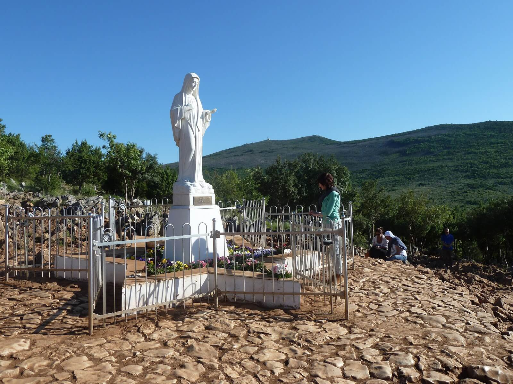

성모님 발현 20주년이 되는 날 발현이 있은 그 장소에서 본당 앞마당에 있는 성모님과 같은 형상의 평화의 모후 성모상이 안치되었는데, 이는 디노 펠리치(Dino Felici)가 조각했다. 순례자들은 발현산에서 개인 기도와 묵주기도를 통해 성모님과 만나게 된다. 2002년 청 십자가(the Blue Cross)쪽으로 내려가는 길에 역시 까르멜로 뿌쫄로 교수의 작품인 묵주기도 영광의 신비 청동 부조가 설치되었다. 발현산 밑에는 1985년에 세워진 청 십자가가 있다. 이 장소는 발현 초창기 공산당의 박해가 있던 시절 목격증인들이 성모님의 발현을 위해 비밀스럽게 찾던 곳이며, 1982년 7월 4일부터 이반의 기도 모임이 이곳에서 정기적인 기도 모임을 해오고 있다.

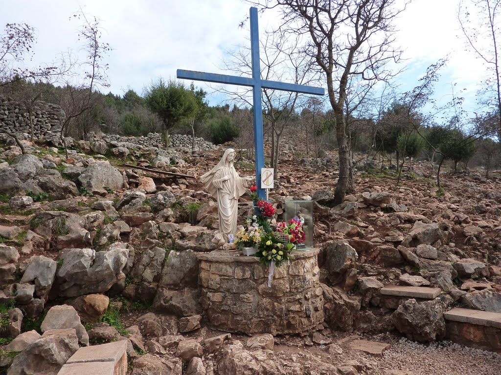

---

### 십자가산(크리자밧, Krizevac, Cross Mountain)

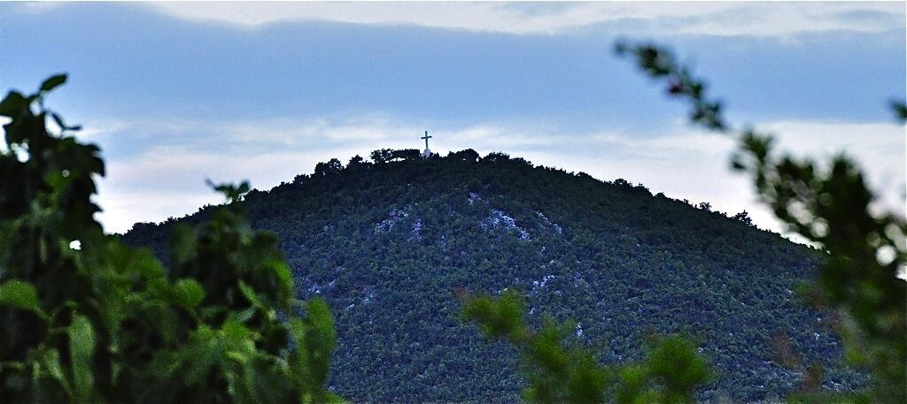

520 미터의 십자가산은 본래 시포박이라는 이름의 산이었다. 그러나 1933년 본당 신자들이 농작물에 피해를 주는 우박을 동반한 폭풍우가 멈춘 것에 대해 감사하고 예수님 수난 1900년을 기념하기 위해 1934년 3월 15일 8.56 미터 높이의 콘크리트 십자가를 세운 다음 그 이름이 크리자밧((KRIZ는 크로아티아어로 '십자가'라는 뜻이다)으로 바뀌었다. 그 십자가에는 **“예수 수난 1900년을 기념하면서 인류의 신앙, 사랑 그리고 희망을 모아 인류의 구속자이신 예수 그리스도께”** 라는 글귀가 새겨져 있다. 로마에서 온 십자가의 유해 조각이 십자가산의 십자가 종단 부분에 들어가 있다. 그 때 이후로 복되신 동정 마리아 탄생 축일이 지난 첫 번째 주일 성 십자가 현양을 기념하기 위해 십자가 아래서 미사를 드리는 관습이 생겨났다.

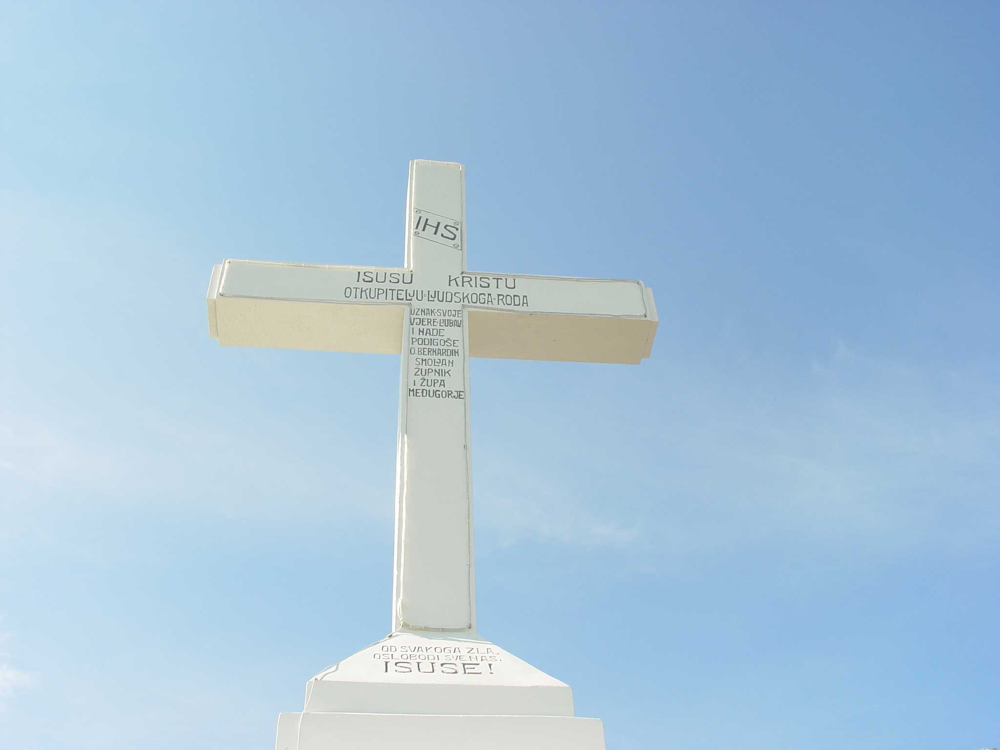

목격증인들에 따르면 1984년 8월 30일 메시지에서 성모님께서는 **“너희가 십자가를 세울 때 그것 또한 하느님의 계획 속에서 이루어진 것이다.”** 라고 말씀하셨다. 순례자들에게 십자가산은 예수님의 수난에서 그분을 만나고 그분의 사랑을 발견하라는 부르심이다. 슬라브코 바르바리치 신부의 추모 1주기인 2001년 11월 24일, 그가 자신의 영혼을 하느님의 손에 맡겼던 장소에 그를 추모하기 위해 돌에 그의 흉상 청동 부조를 세웠다. 13처와 14처 사이에 있는 이 부조물은 복음과 육화된 말씀의 어머니, 평화의 모후의 메시지를 따라 생각하고 행하고 말한 한 인물을 알리고 기억하는 상징물이다.

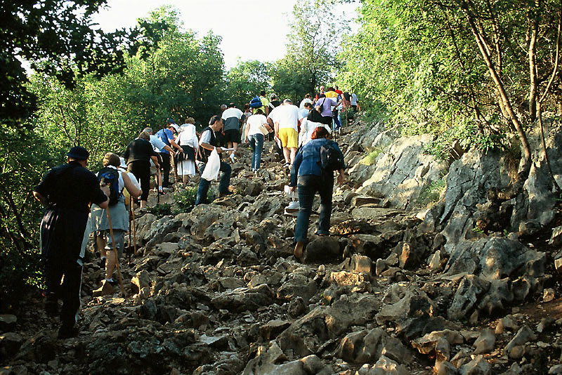

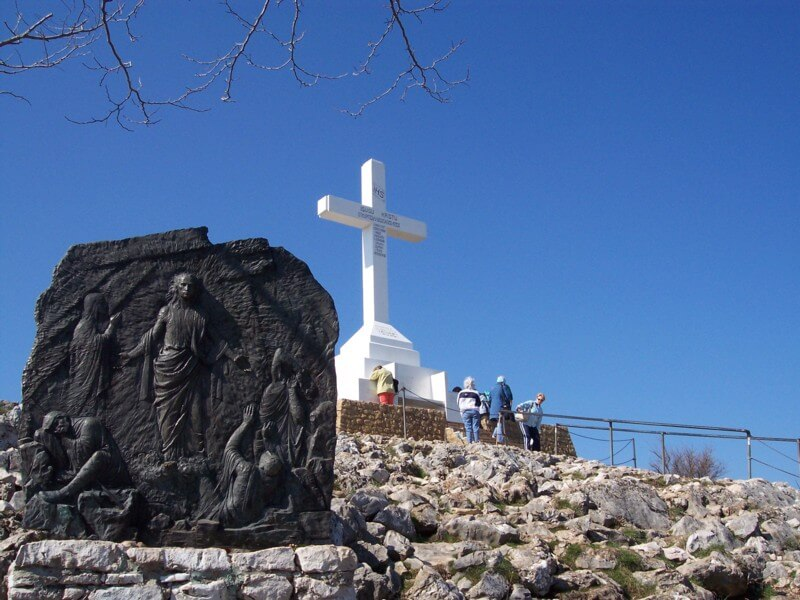

---

### 성체조배 경당

성체조배 경당(소성당)은 순례자들이 침묵 가운데 성체 안에 계신 예수님을 조배할 수 있도록 하기 위해 1991년에 세워졌다. 메주고리예 성지 안에 기도할 수 있는 공간이 부족한 관계로 오전 시간 그곳에서 여러 나라 언어로 미사가 봉헌되고, 오후에는 개인적으로 기도할 수 있도록 개방되어 있다.

---

### 평화의 모후 성모상

디노 펠리치가 대리석으로 조각하여 1987년 본당 앞마당에 설치한 평화의 모후 성모상은 메주고리예 성지의 상징물이 되었다.

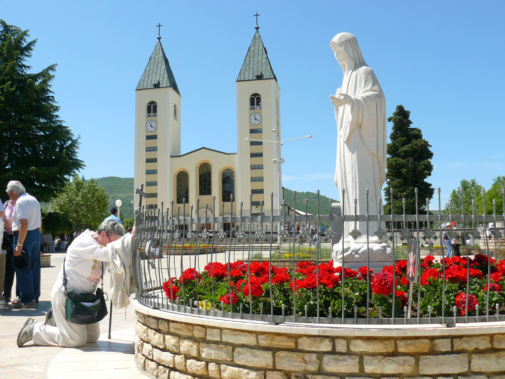

---

### 고해소

성모님 발현 덕분에 메주고리예는 특별히 고해성사를 체험하는 화해의 장소가 되었다. 1990년에 건설되고 2001년에 보수한 25개의 고해소는 성당 외부에 인접해 있다. 이곳에서 신자들은 매일 하느님의 용서를 체험한다.

---

### 체나꼴로 공동체

"체나꼴로” 공동체는 마약 중독자들을 위해 1983년 엘비라 뻬드로찌 수녀에 의해 이탈리아 살루쪼에서 설립되었다. 이 공동체의 주요 목표는 그리스도인의 참된 삶의 가치를 발견하고 그를 사는 것이다. 공동체원들은 예수 그리스도께서 그들을 치유하시고, 기도와 노동 그리고 우정을 통해 치유된다고 증언한다. 진리를 찾는 젊은이들이 메주고리예에서 받는 특별한 은총 때문에 엘비라 수녀는 메주고리에 2개의 공동체를 만들었다. 1991년에 “생명의 밭”으로 불리는 청년들을 위한 공동체 그리고 2000년에는 “기쁨의 밭” 이라 불리는 처녀들을 위한 공동체가 그것이다. 청년들의 “체나꼴로” 공동체는 순례자들을 기쁘게 맞이하고 자신들이 어떻게 마약으로 해방되었고, 회개하게 되었는지 이야기를 들려준다.
