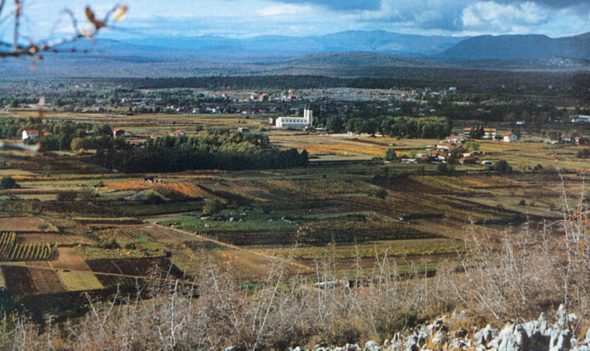
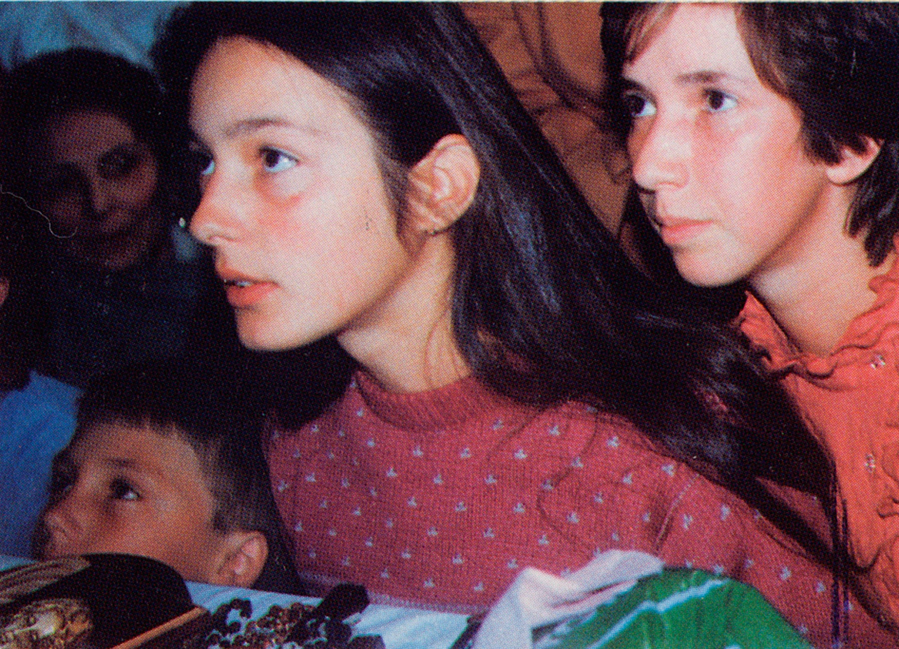
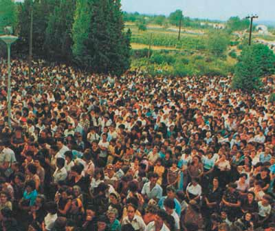
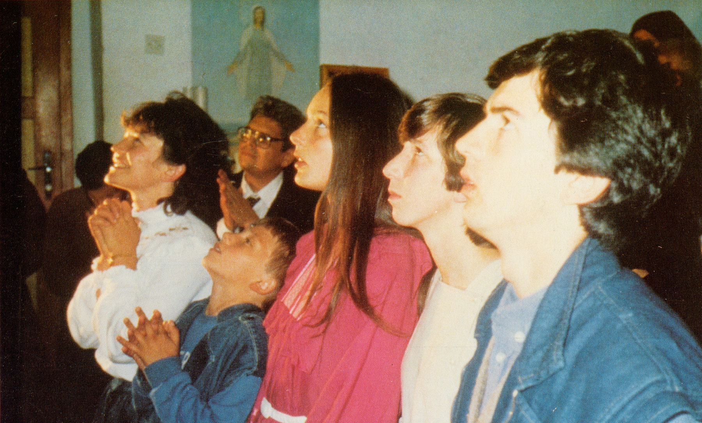
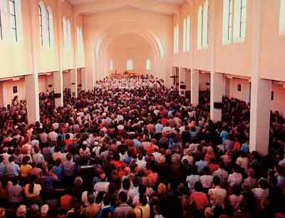
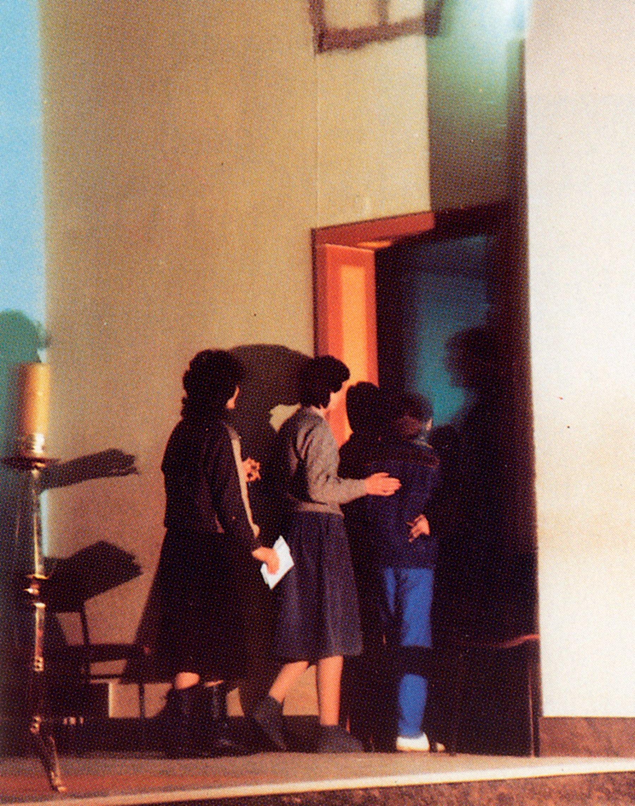

<figcaption class="figure-caption mb-3">첫 발현 당시 발현산에서 내려다 본 메주고리예 마을 전경.
     
    가운데 하얗게 보이는 건물이 성 야고보 성당이다.
</figcaption>

보스니아 헤르체고비나의 치틀룩에 위치한 작은 마을 메주고리예에서는 1981년 6월 24일부터 복되신 동정 마리아 (크로아티아인들은 성모님을 ‘고스파'라는 애칭으로 부른다)께서 거의 매일 발현하고 계신다. 신뢰할 만한 여섯 명의 목격 증인들이 성모님의 매일 발현 사실을 맹세를 통해 확실히 증언하고 있다.

---

### 발현 첫날

1981년 6월 24일, 오후 6시쯤의 일이다. 뽓브르도(발현 언덕)로 알려진 크르니카 언덕에서 이반카 이반코비치, 미라야나 드라기체비치, 비츠카 이반코비치, 이반 드라기체비치, 밀카 파블로비치 라는 5명의 아이들은 말로 표현할 수 없을 만큼 아름다운 젊은 여성이 팔에 어린 아기를 안고 있는 것을 목격한다. 그 아름다운 여성은 한마디 말도 없이 아이들에게 가까이 다가오라는 손짓을 보냈다. 아이들은 그분이 성모님이라는 것을 즉각 알아차리지만 놀랍고도 두려웠던 나머지 차마 가까이 가지 못했다.

---

### 발현 둘째 날

다음 날인 1981년 6월 25일, 그분을 다시 뵐 수 있기를 희망하면서 아이들은 전날 성모님께서 나타나셨던 그 장소에서 다시 만나기로 한다. 그 때 갑자기 아이들 앞에 섬광이 번쩍였는데 고개를 들어 언덕 위쪽을 쳐다보자 아이들 앞에 다시 성모님께서 그 모습을 보여주셨다. 이번에는 그분의 팔에 아기는 없었다. 그분은 미소를 지으시며 기뻐하셨는데 그 모습이 도저히 말로 표현할 수 없을 만큼 아름다우셨다. 그분은 다시 아이들에게 좀 더 가까이 다가오라고 손짓을 하셨다. 아이들은 용기를 내어 그분을 향해 올라갔다. 아이들 즉시 무릎을 꿇고 주님의 기도, 성모송 그리고 영광송을 바치기 시작했다. 성모님께서는 다섯 아이들과 함께 기도를 바치셨지만 성모송은 바치지 않으셨다.

기도가 끝나자 성모님께서는 아이들과 대화하기 시작하셨다. 이반카는 두 달 전에 돌아가신 자신의 어머니에 대해 여쭤 보았다. 또 다른 여자 아이인 미리야나는 자신들이 성모님 발현을 목격했다고 하면 일부 사람들이 거짓말을 한다거나 미쳤다고 말할 테니, 자신들을 증명할 만한 표징을 달라고 성모님께 요청했다.

성모님께서는 마지막으로 **“나의 천사들아! 하느님께서 너희와 함께 하시기를!”** 이라는 말씀을 남기시고 아이들 곁을 떠나셨다. 그분께서 떠나시기 전 다음날에도 다시 뵈올 수 있는지 아이들이 물었을 때, 성모님께서는 고개를 끄덕이시며 그렇다고 응답해 주셨다.

<figcaption class="figure-caption mb-3">
    목격 증인들이 성모님을 마주하며 영적 황홀경에 들어서 있는 모습.
     
    왼쪽부터 조그만 소년 야콥 촐로, 이반카 이반코비치, 그리고 마리야 아브로비치.
</figcaption>

목격 증인들은 그 만남 전체를 말로 설명하는 것은 거의 불가능한 일이라고 말한다. 그 날 이반 이반코비치와 밀카 파블로비치는 발현 언덕에 가지 않았다. 대신 마리야 파블로비치와 야콥 촐로가 그곳에 갔다. 그들의 증언에 따르면, 성모님께서는 발현 둘째 날에 당신의 모습을 보았던 아이들에게 정기적으로 발현하고 계신다고 한다. 비록 밀카 파블로비치와 이반 이반코비치도 몹시 성모님을 뵙고 싶어 했지만, 그들은 다시 그분을 뵙지 못하게 되었다. 그러나 밀카와 이반은 다른 목격 증인들과 함께 했다.

---

### 발현 셋째 날

발현 삼일째인 1981년 6월 26일, 아이들은 성모님께서 그들에게 나타내 보이셨던 그 시간이(오후 6시경) 오기만을 애타게 기다리고 있었다. 그들은 다시 같은 장소를 향해 갔다. 성모님을 뵙고자 하는 열망이 두려움과 뒤섞여 있긴 했지만, 아이들은 이 모든 것의 결과가 무엇일까를 생각하면서 매우 행복해했다. 이러한 모든 사실에도 불구하고 아이들은 성모님께서 그들을 잡아당기는 내적인 힘을 느꼈다.

아이들이 발현 언덕을 향해 가던 중 갑자기 그들 앞에 빛이 세 번이나 번쩍였다. 아이들과 그들을 따라오고 있던 사람들에게 그것은 성모님께서 현존하신다는 것을 알려주는 표징이었다. 이번에는 성모님께서 첫날과 둘째 날보다 더 높은 곳에서 발현하셨다. 그러다가 갑자기 성모님께서 사라지셨는데, 아이들이 기도를 시작하자 다시 나타나셨다. 그분은 밝은 표정에 온화한 미소를 머금고 계셨으며 실로 너무나 아름다운 모습이셨다.

아이들이 집을 나설 때, 몇몇 여자 노인들이 사탄으로부터 보호받기 위해 성수를 가져가라고 아이들에게 충고했다. 성모님께서 발현하셔서 아이들과 함께 있는 동안 성수를 챙겨온 비츠카는 성모님의 모습을 향해 성수를 뿌리면서 다음과 같이 말했다. “만일 당신이 복되신 어머니시라면 저희와 함께 머무소서. 그러나 그렇지 않다면 어서 물러가라!!” 이 모습을 보신 성모님께서는 다만 미소를 지어 보이시며 아이들과 함께 남아계셨다. 그 때 미리야나가 그분의 이름을 여쭤보았고, 그 분께서는 **“나는 복되신 동정 마리아다.”** 라고 대답하셨다.

같은 날 아이들이 뽓브르도에서 내려온 후 성모님께서는 다시 한 번 그들에게 나타나셨다. 그러나 이번에는 마리야 에게만 말씀하셨다. **“평화, 평화, 평화, 그리고 오직 평화만이!”** 마리야는 성모님 뒤편에 십자가가 있는 것을 볼 수 있었다. 그 때 성모님께서는 눈물을 흘리시면서 다음과 같은 말씀을 두 번 반복하셨다. **“하느님과 사람 사이에 그리고 사람들 사이에 평화가 있어야 한다!”**

---

### 발현 넷째 날

1981년 6월 27일 성모님께서는 아이들에게 세 차례나 나타나셨다. 이 때 아이들은 성모님께 온갖 질문을 던졌고, 성모님께서는 이에 모두 답해주셨다. 사제들이 어떻게 해야 하는 지를 물었을 때 성모님께서는 **“그들은 강한 믿음으로 신앙을 지켜야 한다!”** 고 말씀하셨다. 사람들이 그들이 거짓말을 하고 마약을 복용한다고 자신들을 비난하기 시작했기 때문에, 야콥과 미리야나가 다시 한 번 표징을 보여 달라고 성모님께 요청했다. 성모님께서는 “두려워하지 말라” 고 응답하셨다.

헤어지기 전에 아이들은 다시 오실 수 있는지를 물었고, 성모님은 그러겠노라고 확인해주셨다. 뽓브르도를 내려오는 도중에 성모님께서는 다시 한 번 더 모습을 드러내시며 다음과 같은 말씀으로 작별 인사를 하셨다. **“나의 천사들이여, 하느님께서 너희들과 함께 하시기를 빈다. 평화로이 돌아가거라!”**

---

### 발현 다섯째 날

1981년 6월 28일 아침 이른 시간에도 불구하고 벌써 많은 군중들이 곳곳에서 모여들기 시작했다. 정오쯤에는 대략 1만 5천여 명의 인파가 운집해 있었다. 같은 날 메주고리예 본당 사제 요조 조브코 신부는 이전 날들에 아이들이 보고 들은 것에 대하여 조사했다.

<figcaption class="figure-caption mb-3">
    발현 당시 성 야고보 성당 뒷마당에 모여든 거대한 군중들.
</figcaption>

성모님께서는 언제나 발현하시던 그 시간에 아이들에게 다시 나타나셨다. 아이들은 성모님과 함께 기도하고, 질문을 던졌다. 비츠카가 물었다. “사랑하는 성모님, 저희와 저희 신부님들에게 무엇을 바라시나요?” 성모님께서는 **“사람들은 기도하고 굳게 믿어야 한다.”** 고 응답하셨다. 사제들의 경우 그들 자신들도 확고하게 믿어야 하며, 다른 이들의 신앙을 강화시켜주는 역할을 해야 한다고 말씀하셨다.

그날, 성모님께서는 여러 차례 발현하셨다. 한번은 아이들이 성모님께 왜 모든 사람들이 당신을 뵈올 수 있는 본당의 성당에서 발현하시지 않는지를 여쭤 보았다. 성모님께서는 “보지 않고 믿는 사람들은 행복하다.” 고 대답하셨다.

비록 군중들이 아이들에게 수많은 질문을 던졌고 날은 찌는 듯이 더웠지만, 아이들은 자신들이 마치 천국에 있는 것처럼 느꼈다.

---

### 발현 여섯째 날

1981년 6월 29일 사람들은 의학적인 검사를 받도록 하기 위해 아이들을 모스타르로 데리고 갔다. 그러나 아이들의 진찰을 마친 의사는 **“이 아이들은 미치지 않았다. 오히려 그들을 데려온 사람들이 미친 것임에 틀림없다.”** 고 말했다.

그날 발현 언덕을 찾은 군중의 수는 이전의 그 어느 때보다도 많았다. 아이들이 언제나처럼 그 장소에 와서 기도하기 시작하자 성모님께서 발현하셨다. 그 때에 복되신 어머니께서는 모든 사람들에게 굳건하게 믿고 확신을 가지라고 요청하셨다.

<figcaption class="figure-caption mb-3">
    성모님을 마주하며 영적 황홀경에 들어서 있는 목격 증인들.
     
    이들을 의심한 사람들이 수 차례의 의학 검사를 받게 했으나, 증인들 모두 정신적으로 완전히 건강하다는 소견을 받았다.
</figcaption>

그날 아이들을 따라다니면서 관찰하던 한 의사가 발현 중에 성모님을 만져보기를 원했다. 아이들이 그 의사의 손을 성모님의 어깨 부분으로 이끌자, 그녀는 따끔거리고 울렁거리는 감각을 느낄 수 있었다고 증언했다. 그 의사는 비록 무신론자였지만 자신이 느낀 사실을 인정할 수밖에 없었다. “이곳에서 뭔가 이상한 일이 일어나고 있다!”

같은 날 다니옐 쉐트카라는 아이가 기적적으로 치유되었다. 그 부모는 특별히 그 아이의 쾌유를 기원하기 위해 아이를 데리고 메주고리예에 왔던 것이다. 성모님께서는 만일 부모가 계속적으로 기도하고 단식하고, 또 확고하게 믿는다면 치유가 일어날 것이라고 약속하셨다. 그 즉시 아이는 병이 완전히 나았다.

---

### 발현 일곱째 날

1981년 6월 30일, 두 명의 처녀가 목격 증인인 아이들에게 차를 타고 저 멀리 어딘가로 같이 가자고 제안했다. 그들의 진짜 의도는 성모님께서 발현하시는 곳에서 아이들을 멀리 데리고 가서 매번 발현하시는 시간이 지날 때까지 그 곳에 아이들을 붙들어두려는 것이었다. 그러나 뽓브르도에서 아이들이 멀리 떨어져 있었는데도 발현 시간이 되자 아이들은 차에서 재빨리 내릴 것을 재촉하는 성모님의 내적인 부르심을 받았다. 아이들은 곧바로 차에서 빠져나와 기도하기 시작했고, 성모님께서는 뽓브르도 방향에서 -지금 따져보면, 약 1km가 훨씬 넘는 거리에서- 아이들을 향해 가까이 다가오셔서 아이들과 함께 주님의 기도를 일곱 번 바치셨다. 그래서 결국 그 처녀들의 계략은 실패로 돌아갔다.

그 이후 곧바로 경찰들은 아이들과 순례자들이 뽓브르도에 가는 것을 통제하기 시작했다. 비록 아이들과 나중에는 다른 군중들조차도 뽓브르도에 가는 것이 허용되지 않았지만, 성모님께서는 아이들의 집안이나 집 밖과 같이 숨겨진 장소에서 계속 발현하셨다. 아이들은 더 큰 용기를 얻게 되었고, 더욱 더 열린 마음으로 성모님과 대화하며 그분의 조언과 권고 그리고 메시지들을 기쁘게 경청하였다. 이러한 발현은 1982년 1월 15일까지 계속되었다.

한편 본당 신부는 순례자에게 묵주기도에 참여할 것과 본당의 거룩한 미사에 참여할 것을 장려하였다. 아이들도 역시 성당에 와서 묵주기도를 인도했고, 성모님께서도 역시 성당에서 여러 차례 그들에게 발현하셨다. **본당 주임인 요조 조브코 신부도 묵주기도를 바치는 중에 성모님을 뵈었는데, 그 순간 그는 기도를 멈추고 즉석에서 노래를 부르기 시작했다. “당신은 얼마나 아름다우신지요, 동정녀 마리아, 당신은 참으로 아름다우십니다!”** 성당 안에 있던 모든 사람들은 그에게 심상치 않은 일이 일어나고 있음을 알아차렸다. 나중에 요조 신부는 그 자신도 성모님을 뵈었다는 사실을 확증하게 되었다. 발현에 대한 진정성이 증명되지 않는 한 발현에 대해 회의적인 태도를 갖고 있었고, 심지어 발현에 관해 이야기하는 것조차 금기시하던 요조 신부가 이제는 아이들의 대변자가 된 것이다. 요조 신부는 후에 이와 같은 사실을 법정에서 인정하고는 투옥되는 처벌을 받게 된다.

<figcaption class="figure-caption mb-3">
    발현 당시 성모님의 발현을 기다리며 성 야고보 성당에 모여든 목격 증인과 군중들.
</figcaption>

성모님께서는 1982년 1월 15일부터 성당 제대 옆에 있는 작은 방에서 아이들에게 발현하셨다. 새로운 난관과 위험이 발생하자 요조 신부는 아이들을 보호하기 위해 이를 용인해 주었으며, 성모님 또한 이에 동의하셨다. 1985년 4월, 교구장 주교의 요청에 따라 발현의 한 장소였던 이 작은 방을 떠나야 했으며, 그 이후로 아이들은 본당 건물의 작은 방에서 발현을 목격하게 되었다.

<figcaption class="figure-caption mb-3">
    성 야고보 성당 제대 옆 작은 방으로 들어가는 목격 증인들.
     
이곳에서의 발현은 1985년 3월 25일까지 계속되었다.</figcaption>

발현이 시작된 때부터 지금에 이르는 오랜 시간 동안 성모님께서 아이들 중 어느 누구에게도 발현하지 않으셨던 날은 고작 5일뿐 이었다.

성모님께서는 동일한 장소 혹은 동일 집단이나 동일한 사람에게 발현하지 않으셨을 뿐만 아니라 동일하게 지정된 시간 동안 발현하신 것도 아니었다. 어떤 때는 겨우 2분 정도 발현하셨지만 어떤 때는 한 시간 동안 발현하기도 하셨다. 성모님께서는 또한 아이들이 원하거나 소망한다고 해서 그들에게 발현하지는 않으셨다. 어떤 때는 전혀 모습을 보여주시지 않기도 했다. 때때로 아이들은 기도하고 기다렸지만 성모님께서는 그 순간에 발현하지 않으시고, 후에 어떤 사전 예고도 없이 나타나셨다. 그분은 간혹 어떤 아이에게는 발현하시지만 다른 아이들에게는 전혀 모습을 보여주지 않으신 적도 있었다. 그분께서 특정한 시간에 발현하실 것을 약속하지 않으셨을 때, 어느 누구도 그분이 언제 어디에서 발현하실지 예측할 수 없었다.

**성모님은 위에서 언급한 목격 증인들에게만 발현하신 것이 아니라 나이나 국적, 직업이나 교육 정도가 다른 사람들에게도 발현하셨다. 이와 같은 사실들은 성모님의 발현이 결코 인간의 상상력의 산물이 아니라는 점을 여실히 보여주고 있는 것이다. 성모님 발현은 시간이나 장소와 상관이 없으며 목격 증인이나 순례객들의 간절함과 기도와도 상관없이 오로지 성모님의 의지에 따라 이루지는 것임을 이 모든 것들이 확증해주고 있다.**
